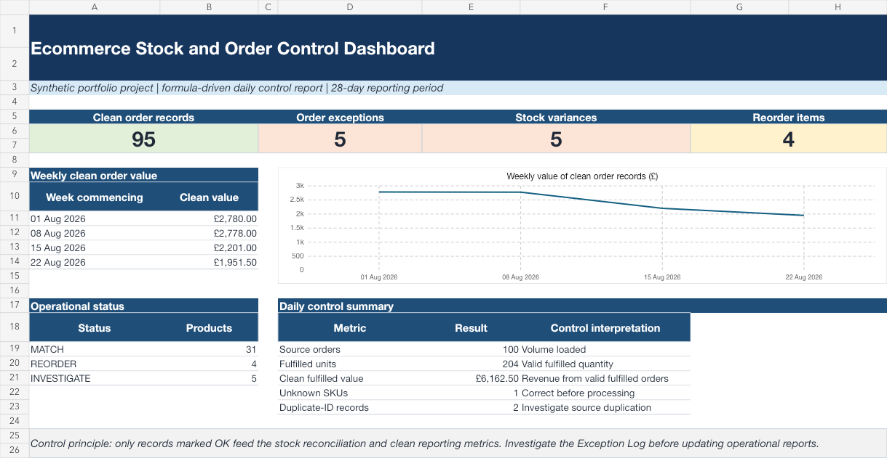
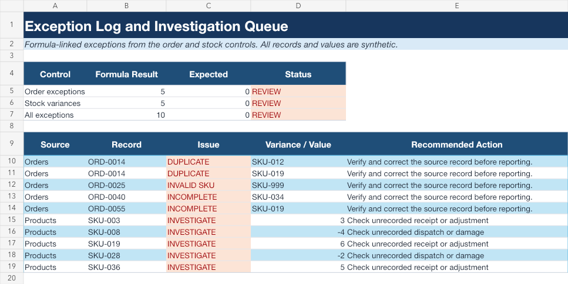

# Ecommerce Stock and Order Control in Excel

A formula-driven operational workbook for maintaining ecommerce product, stock and order data. It demonstrates the daily controls a Junior Data Administrator could use to validate records, reconcile inventory, investigate discrepancies and maintain a repeatable report.

> **Portfolio disclosure:** every product, order, price and operational result in this project is synthetic. The workbook demonstrates Excel and data-administration skills; it does not represent commercial employment experience.

## Project result

The workbook processes **100 synthetic orders across 40 products**, separates clean records from exceptions and uses only clean records in stock reconciliation and reporting.

| Control result | Records |
|---|---:|
| Clean order records | 95 |
| Order exceptions requiring review | 5 |
| Stock variances requiring investigation | 5 |
| Products below their reorder level | 4 |
| Unknown SKU records | 1 |
| Duplicate-ID records | 2 |

Only order rows marked `OK` feed the stock reconciliation and clean reporting metrics.

## Workbook structure

| Worksheet | Purpose |
|---|---|
| `Dashboard` | Presents clean-order, exception, variance and reorder KPIs, a weekly value trend and a daily control summary |
| `Products` | Reconciles opening stock and deliveries against clean fulfilled orders, then compares expected closing stock with the system balance |
| `Orders` | Validates order IDs, SKUs, quantities, required fields and calculated line values |
| `Exception Log` | Links every deliberately introduced order and stock discrepancy to a recommended investigation action |

## Excel controls demonstrated

- `INDEX` and `MATCH` retrieve unit prices from the product master using the SKU.
- `SUMIFS` calculates fulfilled quantities, weekly order value and clean fulfilled value.
- `COUNTIF` and `COUNTIFS` detect duplicate order IDs, validate SKUs and count clean orders by product.
- Data-validation lists standardise order status and customer region inputs.
- Conditional formatting highlights duplicate, incomplete and invalid order records, stock variances and reorder items.
- Formula-driven stock reconciliation calculates:

  `Expected closing stock = Opening stock + Deliveries - Clean fulfilled units`

- Exception handling keeps invalid records out of the operational metrics until they are reviewed.
- Structured Excel tables, filters, frozen headers and explicit number/date formats make the workbook easy to update and audit.

## Deliberate test exceptions

The synthetic source data includes controlled errors so the workbook can demonstrate investigation logic:

- One duplicated order ID, affecting two records
- One unknown SKU
- One missing order status
- One zero-quantity order
- Five stock balances that do not match the calculated closing stock

## How to review the project

1. Download and open [`Ecommerce-Stock-and-Order-Control.xlsx`](Ecommerce-Stock-and-Order-Control.xlsx) in Microsoft Excel.
2. Start on the `Dashboard` worksheet.
3. Review the five order exceptions and five stock variances on the `Exception Log` worksheet.
4. Trace the linked order or SKU back to its source worksheet.
5. Inspect the formulas and input validation to see how clean records flow into the report.

## Skills demonstrated

`Excel` · `Stock Data` · `Order Data` · `Data Quality` · `Reconciliation` · `INDEX/MATCH` · `SUMIFS` · `COUNTIFS` · `Data Validation` · `Conditional Formatting` · `Exception Reporting` · `Operational Dashboard`
